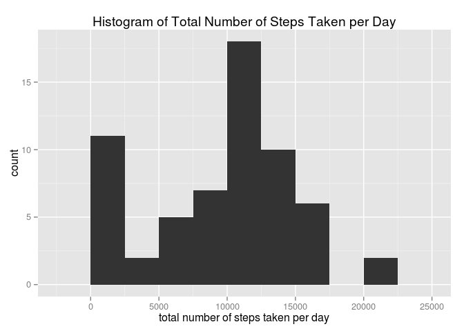
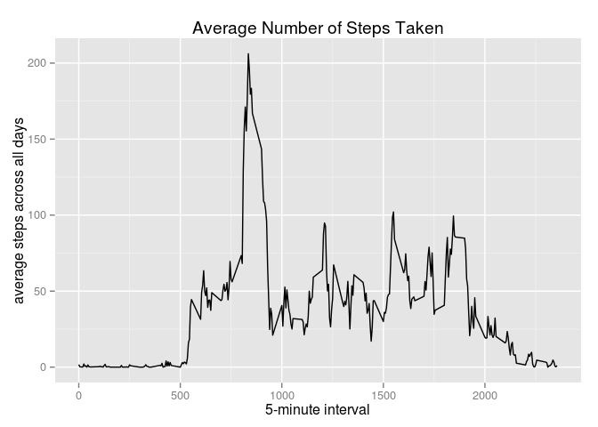
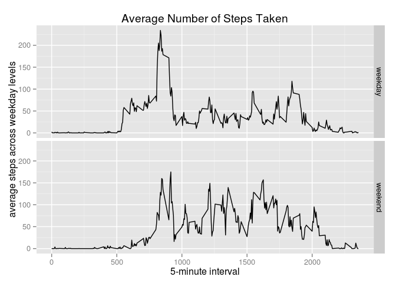

# Reproducible Research: Peer Assessment 1


```r
knitr::opts_chunk$set(echo=FALSE)
```

## Loading and preprocessing the data
1  
The data is coming from the Dataset: [Activity monitoring data](https://d396qusza40orc.cloudfront.net/repdata%2Fdata%2Factivity.zip)
Which was initial included in this course project.
The zip file contains one file  `activity.csv`. First load the data from this 
file.


The first rows looks like:

```
##   steps       date interval
## 1    NA 2012-10-01        0
## 2    NA 2012-10-01        5
## 3    NA 2012-10-01       10
## 4    NA 2012-10-01       15
## 5    NA 2012-10-01       20
## 6    NA 2012-10-01       25
```

* **steps**: Number of steps taking in a 5-minute interval (missing
    values are coded as `NA`)

* **date**: The date on which the measurement was taken in YYYY-MM-DD
    format

* **interval**: Identifier for the 5-minute interval in which
    measurement was taken

2  
The date is now of class factor. Transform this to a Date


Then transform to use dplyr to make analysis easier


```
## 
## Attaching package: 'dplyr'
## 
## The following objects are masked from 'package:lubridate':
## 
##     intersect, setdiff, union
## 
## The following objects are masked from 'package:stats':
## 
##     filter, lag
## 
## The following objects are masked from 'package:base':
## 
##     intersect, setdiff, setequal, union
```

## What is mean total number of steps taken per day?

Make a new table with the steps per day.
And show a histogram of this data

 

The mean of the steps is: 9354.2295082  (`mean(activityDaily$steps, na.rm = TRUE)`)  
The median of the steps is: 10395 (`median(activityDaily$steps, na.rm = TRUE)`)  


## What is the average daily activity pattern?

Make a new table grouped by the time of the day. (the 5 minute interval) 
and a new column with the average number of steps taken, averaged across all days

 

The 835
is the 5-minute interval, on average across all the days in the dataset, which contains the maximum number of steps.  

The R code is: 
`activityTime$interval[which(activityTime$averageSteps == max(activityTime$averageSteps))]`

## Imputing missing values

In the dataset, several rows are missing data. (`NA`). 
There are a total of 2304 rows with missing data  
R code: `sum(is.na(activity))`

To impute the missing data, the strategy is to take the mean of the interval of all days


From this imputed dataset make a new table with the steps per day. 
And show a histogram of this data. (Same way as first histogram)

 

The mean of the steps is: 1.0766189\times 10^{4}  (`mean(activityDailyImp$steps, na.rm = TRUE)`)  
The median of the steps is: 1.0766189\times 10^{4}  (`mean(activityDailyImp$steps, na.rm = TRUE)`)  

Only the median values differs slightly from the estimate from the first part of the assignment.  
The impact of imputing missing data on the estimates is low. 
The percentage of missing values = 13.1147541%  
R-code: `sum(missing)/dim(act)[1]*100`


## Are there differences in activity patterns between weekdays and weekends?

Add a new column to the datasets with a factor variable with the levels for weekday and weekend days


```
## Source: local data frame [6 x 4]
## 
##   steps       date interval dayType
##   (int)     (time)    (int)  (fctr)
## 1    NA 2012-10-01        0 weekday
## 2    NA 2012-10-01        5 weekday
## 3    NA 2012-10-01       10 weekday
## 4    NA 2012-10-01       15 weekday
## 5    NA 2012-10-01       20 weekday
## 6    NA 2012-10-01       25 weekday
```

Make a new table grouped by the time of the day. (the 5 minute interval) and the type of the day (weekday or weekend)
and a new column with the average number of steps taken, averaged across the weekdays or the weekend days

 
